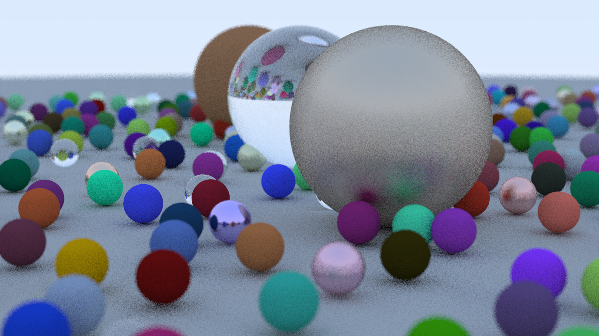

# Raytracing
This project implements a raytracer in C++. The project can be built by navigating to Raytracing/src and running 'make'. Then a raytraced world can be rendered with './raytracer'.

This raytracer can render two types of objects and 3 types of materials.

## Objects
The two types of objects are Spheres and Cubes. Spheres are defined by a center point and a radius, while cubes are defined by a center point and half the width of a side. Cubes currently do not have any rotation.

## Materials
The three types of materials are Lambertian, Metallic, and Dielectric. Lambertian objects are matte, meaning that they are not reflective or refractive. The Lambertian type takes a colour as a parameter. Metallic materials are reflective. The Metallic type takes a colour and a fuzziness as parameters. The fuzziness determines how reflective it is. Dielectric materials are clear materials that both reflect and refract light. The Dielectric type takes a refractive index, which determines how the material refracts light (air = 1.0, glass = 1.3-1.7, diamond = 2.4).

## Camera
The camera for the raytracer can also be manipulated. The aspect ratio, field of view, depth of field, and camera location are all parameters for the camera class.

